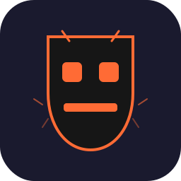

<p align="center">
  
</p>

<h1 align="center">🗿 CHUNGUS SKILLS</h1>
<p align="center"><strong>One install. AI becomes coding god.</strong></p>

<p align="center">
  <a href="https://skills.sh/oatmealyn-creator/chungus-skills">
    
  </a>
  <a href="https://chungus-skills.vercel.app">
    
  </a>
  <a href="./LICENSE">
    
  </a>
  
  
</p>

<pre align="center">
CHUNGUS SEE BAD CODE.  CHUNGUS FIX.
CHUNGUS SEE SLOP.      CHUNGUS REMOVE.
CHUNGUS SEE SHIP WITHOUT CHECK.  CHUNGUS STOP.
CHUNGUS SEE CONTAINER DIE.  CHUNGUS BRING BACK.
</pre>

---

## What Is This?

One SKILL.md file that makes any AI agent automatically:

- **Write minimal code** (ponytail's 7-rung ladder: YAGNI → stdlib → native → one line)
- **Never produce AI slop** (40+ anti-pattern detectors: no Inter font, no purple gradients, no cream bg, no glassmorphism, no nested cards, no bounce easing...)
- **Optimize React/Next.js** (70 perf rules from Vercel Engineering)
- **Run prelaunch audits** (8-step checklist before every deploy: vibe check → analytics → payments → break DB → API bypass test → blocking check → legal compliance → operational resilience)
- **Self-heal containers** (Docker HEALTHCHECK, restart policies, graceful shutdown, K8s liveness/readiness/startup probes)
- **Follow TDD** (red-green-refactor, vertical slices)
- **Fix architecture** (deepening scan, clean seams, deletion test)
- **Secure your app** (auth bypass, RLS patterns, SQL injection, XSS, secrets)
- **Track progress** (built-in TODO checklist on every task)

**Zero commands to remember. AI does it all automatically.**

---

## Quick Install

```bash
npx skills add oatmealyn-creator/chungus-skills
```

That's it. AI loads chungus. AI becomes coding god.

| Agent | Support | Agent | Support |
|-------|---------|-------|---------|
| Claude Code | ✅ | Cursor | ✅ |
| Windsurf | ✅ | Cline | ✅ |
| GitHub Copilot | ✅ | Gemini CLI | ✅ |
| OpenCode | ✅ | Codex CLI | ✅ |
| Aider | ✅ | Augment | ✅ |
| Continue | ✅ | Goose | ✅ |

Works on **72 agents total**.

---

## How It Works

```
SESSION START → AI reads chungus
                └── GOLDEN RULE locked in context
                    │
    EVERY TURN  ─────┤
    ┌────────────────┘
    │  PHASE 1 (always): YAGNI → codebase → stdlib → native → dep → one line → minimum
    │                   Delete over addition. Root cause fix. Parallel fetches.
    │
    WRITES FILE ──────┤
    ┌─────────────────┘
    │  PHASE 2: 40+ anti-slop detectors. 70 React perf rules.
    │           Deep modules. Clean seams. TDD loop. TODO tracking.
    │
    SHIPS/DEPLOYS ────┤
    ┌──────────────────┘
    │  PHASE 3: AI creates prelaunch checklist → ticks each step:
    │  [ ] Vibe check  [ ] Analytics  [ ] Payments  [ ] Kill DB
    │  [ ] API bypass  [ ] Blocking    [ ] Legal    [ ] Ops resilience
    │
    RUNS CONTAINER ───┤
    ┌──────────────────┘
    │  PHASE 4: AI generates health checks, restart policies, probes:
    │  [ ] HEALTHCHECK  [ ] restart policy  [ ] graceful shutdown
    │  [ ] /health + /ready  [ ] K8s probes  [ ] logs to stdout
```

---

## What Your AI Will Never Do Again

| AI Slop | Chungus Says |
|---------|-------------|
| Inter font on everything | ❌ "Pick a deliberate typeface for THIS project" |
| Purple-to-blue gradient | ❌ "Single solid color or brand palette" |
| Cream/beige background | ❌ "True off-white or brand color, not warm default" |
| Cards inside cards inside cards | ❌ "One card level maximum" |
| Glassmorphism on everything | ❌ "Rare and purposeful, or nothing" |
| `01 · About / 02 · Process / 03 · Pricing` | ❌ "Only if content is actually a sequence" |
| `border-radius: 40px` on a card | ❌ "12-16px max. Pill only for tags." |
| Big number + small label + stats | ❌ "Content-driven layout, not template" |
| `background-clip: text` gradient | ❌ "Single solid color. Use weight for emphasis." |
| Bounce easing `cubic-bezier(0.68, -0.55, 0.27, 1.55)` | ❌ "ease-out-quart or exponential" |
| `border-left: 4px solid` accent on cards | ❌ "Full border or background tint or nothing" |

---

## What You Get Before Every Ship

```
📋 CHUNGUS PRELAUNCH CHECKLIST
[ ] STEP 1 — Vibe-coding self-check (badges? template animations? broken checkout?)
[ ] STEP 2 — Analytics (Umami or Supabase)
[ ] STEP 3 — Payment flow — SUCCESS + FAILURE both tested
[ ] STEP 4 — Break it — kill DB, check for stack trace leaks
[ ] STEP 5 — API auth bypass — hit endpoints without token
[ ] STEP 6 — Blocking behavior — connection pooling? concurrent? cached?
[ ] STEP 7 — Legal — Privacy Policy, CalOPPA, COPPA, GDPR, Terms, Trademark
[ ] STEP 8 — Operational resilience — HEALTHCHECK, restart policy, graceful shutdown, /health + /ready
```

No other skill on skills.sh does this. Yours truly.

---

## Credits

Built by combining the best parts of the most popular agent skills. Full respect to the originals:

### Design & UI
- **frontend-design** (anthropics/skills) — 579K installs
- **web-design-guidelines** (vercel-labs/agent-skills) — 409K
- **impeccable** (pbakaus/impeccable) — 169K
- **ui-ux-pro-max** (nextlevelbuilder) — 230K
- **minimalist-ui**, **high-end-visual-design**, **design-taste-frontend**, **industrial-brutalist-ui**, **stitch-design-taste**, **full-output-enforcement** (leonxlnx/taste-skill)
- **sleek-design-mobile-apps** (sleekdotdesign/agent-skills) — 264K
- **extract-design-system** (arvindrk) — 123K
- **shadcn** (shadcn/ui) — 202K
- **simple** (roin-orca/skills) — 202K
- **emil-design-eng** (emilkowalski/skill) — 102K

### React & Next.js
- **vercel-react-best-practices** (vercel-labs/agent-skills) — 496K
- **vercel-composition-patterns** (vercel-labs/agent-skills) — 221K
- **vercel-react-native-skills** (vercel-labs/agent-skills) — 148K
- **next-best-practices** (vercel-labs/next-skills) — 111K

### Engineering Practice
- **grill-me** (mattpocock/skills) — 373K
- **grill-with-docs** (mattpocock/skills) — 304K
- **improve-codebase-architecture** (mattpocock/skills) — 307K
- **tdd** (mattpocock/skills) — 289K
- **to-prd** (mattpocock/skills) — 270K
- **handoff** (mattpocock/skills) — 212K
- **prototype** (mattpocock/skills) — 209K
- **to-issues** (mattpocock/skills) — 259K
- **triage** (mattpocock/skills) — 235K
- **diagnose** (mattpocock/skills) — 229K
- **zoom-out** (mattpocock/skills) — 221K
- **write-a-skill** (mattpocock/skills) — 221K
- **setup-matt-pocock-skills** (mattpocock/skills) — 251K
- **brainstorming**, **writing-plans**, **executing-plans**, **systematic-debugging**, **requesting-code-review**, **receiving-code-review**, **test-driven-development**, **subagent-driven-development**, **verification-before-completion**, **dispatching-parallel-agents**, **using-git-worktrees**, **finishing-a-development-branch**, **writing-skills**, **using-superpowers** (obra/superpowers)

### Token Efficiency
- **caveman** (juliusbrussee/caveman) — 275K
- **ponytail** (DietrichGebert/ponytail) — 50K

### Security
- **supabase** + **supabase-postgres-best-practices** (supabase/agent-skills) — 381K combined
- **SkillSpector** (NVIDIA) — 9.3K
- **openclaw-secure-linux-cloud** (xixu-me/skills) — 232K

### Data
- **firebase-basics**, **firebase-auth-basics** (firebase/agent-skills) — 177K combined

### Documents
- **pdf**, **pptx**, **docx**, **xlsx** (anthropics/skills) — 545K combined

### Browser
- **agent-browser** (vercel-labs/agent-browser) — 475K
- **just-scrape** (scrapegraphai) — 211K
- **webapp-testing** (anthropics/skills) — 101K

### Marketing
- **seo-audit**, **copywriting**, **marketing-psychology**, **content-strategy**, **programmatic-seo**, **marketing-ideas** (coreyhaines31/marketingskills) — 646K combined

### Video
- **remotion-best-practices** (remotion-dev/skills) — 386K

### DevOps & Runtime
- **github-actions-docs** (xixu-me/skills) — 237K
- **sentry-cli** (sentry/dev) — 88K
- **Container health probes** (K8s liveness/readiness/startup patterns)
- **Docker HEALTHCHECK + restart policies** (unless-stopped best practices)
- **Graceful shutdown** (SIGTERM handling for Node/Go/Python)

### Skills
- **skill-creator** (anthropics/skills) — 283K
- **find-skills** (vercel-labs/skills) — 2.2M

### Prelaunch Audit
- Original 7-step structure by [oatmealyn-creator](https://github.com/oatmealyn-creator)

---

## Platform Support

Works on all 72 agents including: Claude Code, Cursor, Windsurf, Cline, GitHub Copilot, Gemini CLI, OpenCode, Codex CLI, Antigravity CLI, Kiro CLI, Trae, Zed, Replit, Aider, Augment, Continue, Goose, Pi, Roo, and 53 more.

---

## License

MIT — free like big mammoth on open plain.
